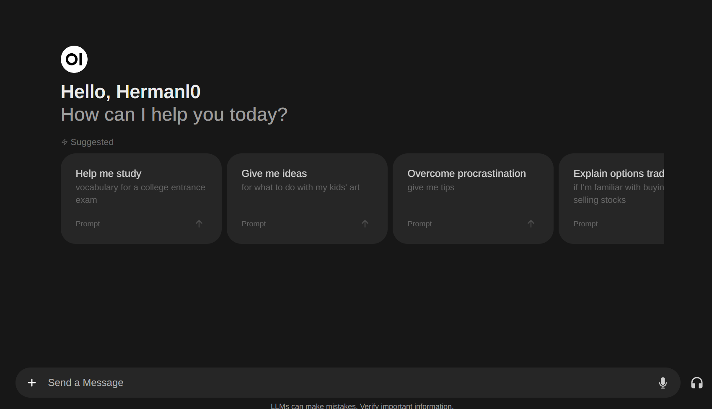

# hermanl0's Personal Site

Welcome to my personal blog! 

## Latest Blog Posts

### [Automated iperf3 Reports to GitHub Pages](./_posts/automated-iperf3-reports-to-github-pages.md)
*2024*

Learn how to automate network performance testing with iperf3 and present the results on GitHub Pages. This solution creates markdown reports automatically when clients connect to the iperf3 server.

---

### [Setting up Local LLM with Ollama and Open WebUI](./_posts/local-ollama-webui.md)
*2024*

Learn how to set up your own local Large Language Model using Ollama and Open WebUI. This tutorial walks you through installing Ollama on Ubuntu, setting up Docker, and configuring Open WebUI for a complete local AI experience.

---

### [Useful Cisco Commands for Network Administration (IOS and NX-OS)](./_posts/cisco-useful-commands.md)
*2024*

A comprehensive guide to essential Cisco commands for network administrators working with both IOS and NX-OS platforms.

---

## Connect With Me

- 📧 Email: [hermanl0@proton.me](mailto:hermanl0@proton.me)
- 💼 LinkedIn: [Herman Loennechen](https://www.linkedin.com/in/hermanl0/)

---

### Navigation

- [All Blog Posts](./_posts/)
- [GitHub Profile](https://github.com/hermanl0)

