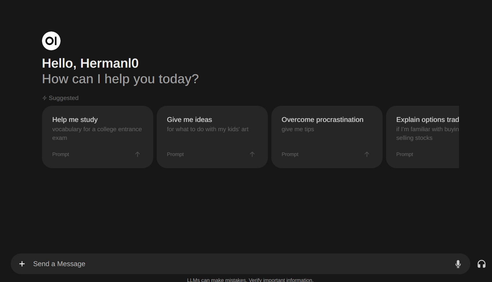

[Open WebUI](https://github.com/open-webui/open-webui) + [Ollama](https://ollama.com/) is pretty cool and easy to set up.



## Prepare Ubuntu

In this example I used a fresh Ubuntu 24.04 LTS install.

```bash
sudo apt update
...
sudo apt upgrade
...
```

## Install Ollama

```bash
https://ollama.com/download

user01@ubuntu:~$ curl -fsSL https://ollama.com/install.sh | sh
```

Pull and run llama3

```bash
user01@ubuntu:~$ ollama run llama3
pulling manifest 
pulling 6a0746a1ec1a...  12% ▏ 562 MB/4.7 GB   87 MB/s
```

## Install Docker

Reference: https://get.docker.com

```bash
user01@ubuntu:~$  curl -fsSL https://get.docker.com -o install-docker.sh

user01@ubuntu:~$ sh install-docker.sh --dry-run
# Executing docker install script, commit: ...
```

## Verify that Docker is Working

```bash
user01@ubuntu:~$docker pull hello-world

user01@ubuntu:~$docker run hello-world

Hello from Docker!
...
```

## Install Open Web UI 

https://docs.openwebui.com/

```bash
user01@ubuntu:~$ sudo docker run -d -p 8080:8080 --network=host -v 
/media/jeremy/
docker/data/open-webui:/app/backend/data -v
/media/jeremy/docker/docs:/data/docs -e 
OLLAMA_BASE_URL=http://127.0.0.1:11434 
--name open-webui --restart always 
ghcr.io/open-webui/open-webui:main
```

Now your web server should be available at port 8080. The first account you create will be an admin account.


Next, you can enable memories: Settings - Personalization - Memory


Now your local llm will also remember the implanted memories:


