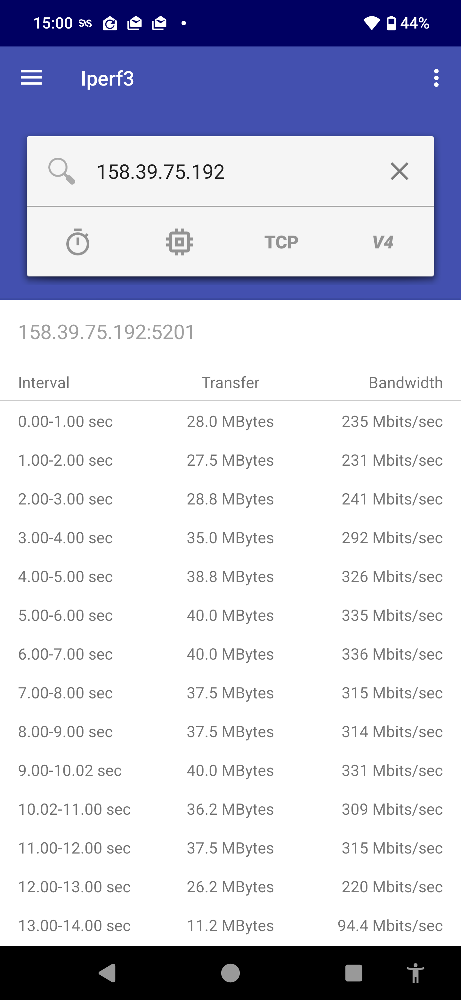
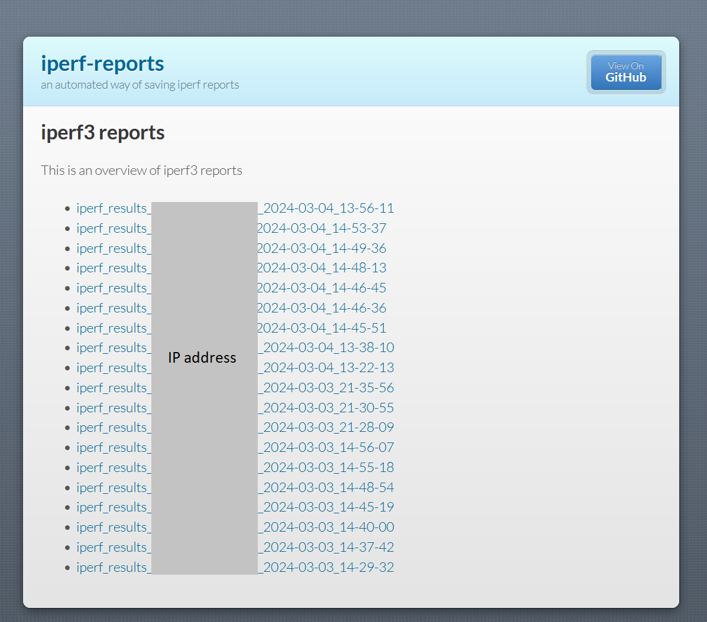
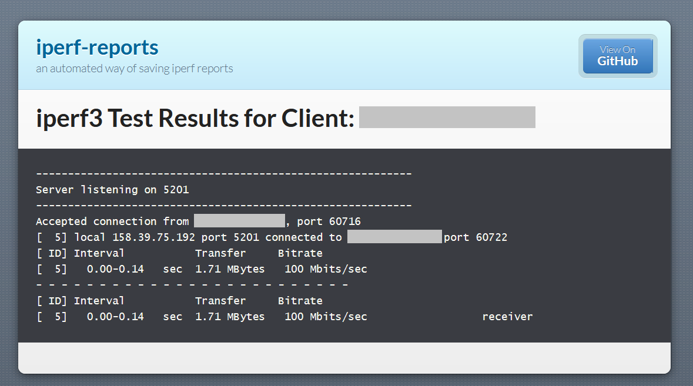

I was curious about automating markdown reports using data I had gathered. Iperf3 is an excellent tool for conducting network performance tests, especially for Wi-Fi connections, which can vary based on signal attributes. Github pages also offers a good way to present markdown files. When combined, these elements create a practical method for presenting automated reports on a website without requiring a dedicated web server outside of github.

# The Flow

The python script listen continuously for new connections. When a new test is completed, a markdown file is created and pushed to the github repo, which displays all of the reports in a sorted way on the connected github page.


## Dependencies

* iperf3 installed on a server, listening on port 5201
* iperf3 installed on a client, this can be an app on your phone
* a github repo


```yaml
(optional) _config.yml file: with the following

remote_theme: pages-themes/modernist@v0.2.0
plugins:
  - jekyll-remote-theme # add this line to the plugins list if you already have one

show_downloads: false
```

## The Script

```python
import subprocess
import os
import signal
import re
from datetime import datetime
from pathlib import Path

# Configuration
port = "5201"
commit_msg = "Updated test results"

# Global variable to control the server loop
running = True

# Create a path to the 'mdexport' directory
md_export_path = Path('mdexport')
md_export_path.mkdir(parents=True, exist_ok=True)

# Function to handle SIGINT (Ctrl+C)
def handle_sigint(sig, frame):
    global running
    running = False

# Register the SIGINT handler
signal.signal(signal.SIGINT, handle_sigint)

# Function to extract the client's IP from the iperf3 test output
def extract_info(output):
    match = re.search(r'Accepted connection from (.*), port', output)
    if match:
        client_ip = match.group(1)
        return client_ip
    else:
        print("Unable to extract client IP from iperf3 output")
        return None

# Function to commit and push changes to GitHub repository
def git_push():
    with open("index.md", "w") as index_file:
        index_file.write("## iperf3 reports\n\n")
        index_file.write("This is an overview of iperf3 reports\n\n")

        report_files = sorted(md_export_path.glob('*.md'), reverse=True)
        for report_file in report_files:
            # Format the report link as a relative URL to serve on GitHub Pages
            relative_link = os.path.relpath(report_file, ".")
            index_file.write(f"- [{report_file.stem}]({relative_link})  \n")

    subprocess.run(['git', 'add', '.'])
    subprocess.run(['git', 'commit', '-m', commit_msg])
    subprocess.run(['git', 'push'])

# Function to check output and create Markdown file if test is valid
def process_and_save_output(output):
    if "Accepted" in output:
        print("Valid test. Generating report...")
        client_ip = extract_info(output)
        timestamp = datetime.now().strftime('%Y-%m-%d_%H-%M-%S')
        results_md_path = md_export_path / f"iperf_results_{client_ip.replace('.', '-')}_{timestamp}.md"

        with open(results_md_path, 'w') as md_file:
            md_file.write(f"# iperf3 Test Results for Client: {client_ip}\n\n")
            md_file.write("``` \n")
            md_file.write(output)
            md_file.write("\n``` \n")

        git_push()
    else:
        print("No valid connections detected during test.")

# Main server loop
def main():
    global running
    subprocess.run(["pkill", "-f", "iperf3 -s"])
    print("iperf3 server has been restarted.")
    print("iperf3 server script is running. Press Ctrl+C to stop.")

    while running:
        try:
            result = subprocess.run(["iperf3", "-s", "-p", port, "--one-off"], capture_output=True, text=True)
            process_and_save_output(result.stdout.strip())
        except subprocess.SubprocessError as e:
            print("Subprocess error occurred: ", e)

    print("Exiting iperf3 server script.")

if __name__ == '__main__':
    main()
```

When testing, it will look like this:

## iPhone Client


## Android Client



And finally, the results will be presented on this website:

## GitHub Pages



## Individual Report



End
